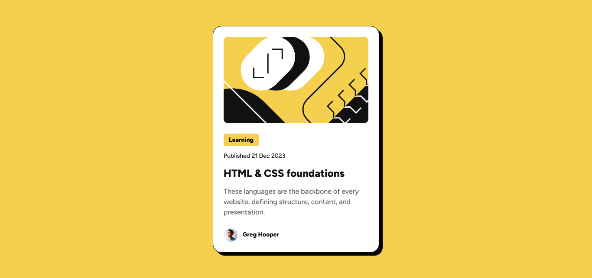
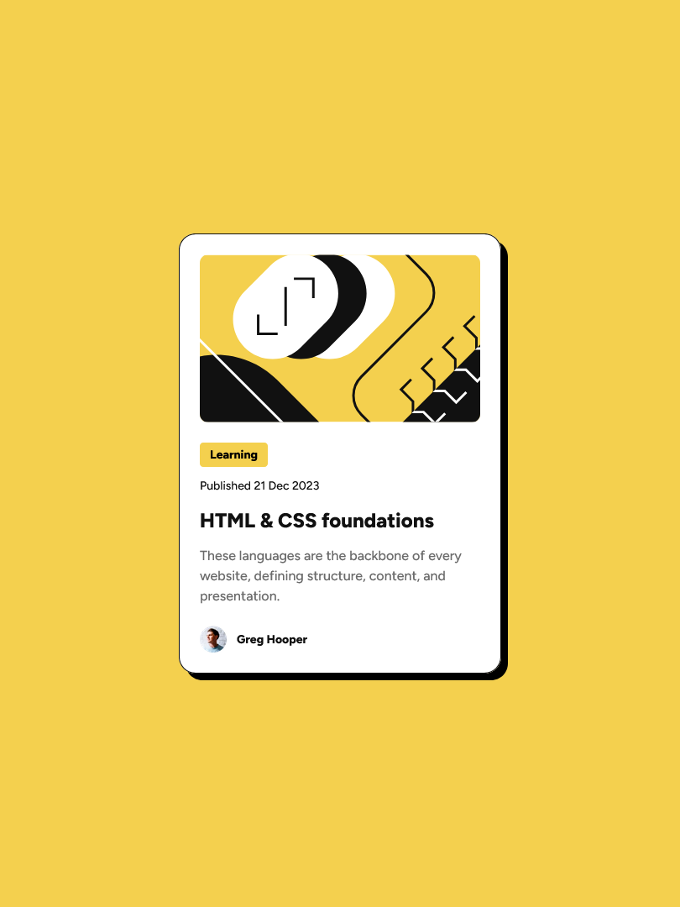
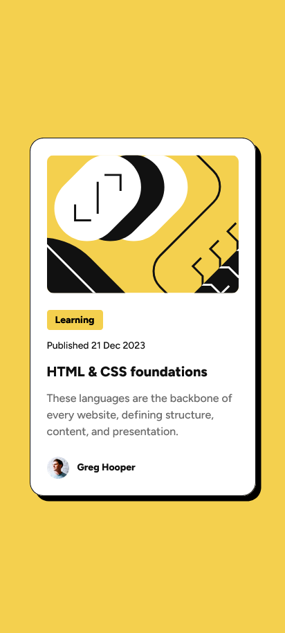

# Frontend Mentor - Blog preview card solution

This is a solution to the [Blog preview card challenge on Frontend Mentor](https://www.frontendmentor.io/challenges/blog-preview-card-ckPaj01IcS). Frontend Mentor challenges help you improve your coding skills by building realistic projects. 

## Table of contents

- [Overview](#overview)
  - [The challenge](#the-challenge)
  - [Screenshot](#screenshot)
  - [Links](#links)
- [My process](#my-process)
  - [Built with](#built-with)
  - [Continued development](#continued-development)
- [Author](#author)
- [Acknowledgments](#acknowledgments)

## Overview

### The challenge

Users should be able to:

- See hover and focus states for all interactive elements on the page

### Screenshot

## desktop

## Tablet

## Mobile

### Links

- Solution URL: [https://github.com/asad102/blog_preview_card](https://github.com/asad102/blog_preview_card)
- Live Site URL: [https://asad102.github.io/blog_preview_card/](https://asad102.github.io/blog_preview_card/)

## My process

### Built with

- Semantic HTML5 markup
- CSS custom properties
- Flexbox
- CSS Grid
- Mobile-first workflow
-  [Tailwindcss](https://tailwindcss.com/) - CSS Framework

### Continued development

CSS & JS

## Author

- Website - [Abdirahim Ali](https://www.abdirahimali.com)
- Frontend Mentor - [@asad102](https://www.frontendmentor.io/profile/asad102)
- Twitter - [@abdirahimali](https://x.com/abdirahimali)

## Acknowledgments

Thanks Frontend Mentor For The Challenges
